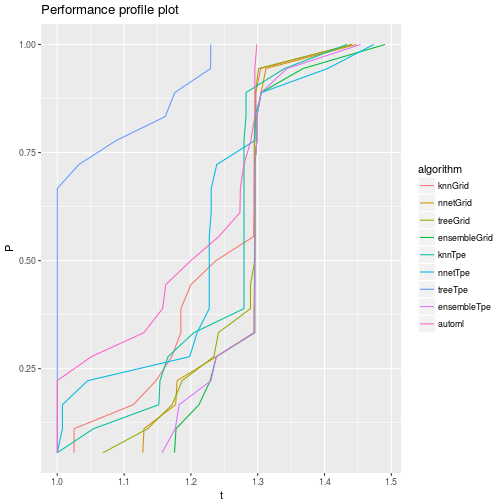

## Description
This is an automatic report generated for the comparison of different machine learning models on benchmark datasets. Performances of models have been gathered during our experiments and are stored under [workspace/benchmarks/thesis_benchmarks.csv](workspace/benchmarks/thesis_benchmarks.csv). You can specify your own file of benchmarks upon calling [experiment.R](experiment.R).

Comparison of algorithms is performed by applying statistical hypothesis testing and providing performance profile plots.

## Hypothesis testing

The number of algorithms compared was 10 and we avoided parametric methods due to lack of certainty about assumptions of sample's probability distribution. Thus, testing technique used was Friedman rank sum test, which resulted in a p-value of 2.5843913 &times; 10<sup>-17</sup> for confidence level 0.95. The null hypothesis can therefore  be rejected. 

Pairs of methods that differ significantly include:


```
## ensembleGrid and automl
## ensembleTpe and automl
## knnGrid and ensembleGrid
## knnTpe and ensembleGrid
## treeTpe and ensembleGrid
## knnGrid and ensembleTpe
## knnTpe and ensembleTpe
## treeTpe and ensembleTpe
## treeTpe and nnetGrid
## treeTpe and nnetTpe
## treeTpe and treeGrid
```


## Performance profile plot

