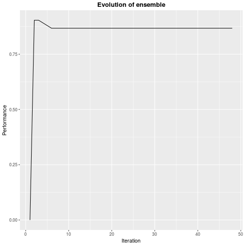
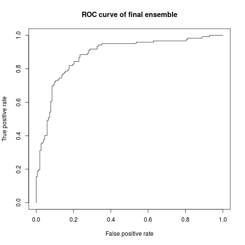

## Description
This is an automatic report generated for the experiment performed on dataset crx.csv. The purpose of this document is to provide information about the pipeline of the experiment and describe the mobilized techniques.

## Dataset description
In this section the dataset is briefly characterized through its features. We provide the perception  of our system and place the experiment's dataset in our current cosmos in order to test if our system is adequately trained for it.

The dataset exhibits 15 features, of which 18 were handled as categorical, of which 0 are ordered.

The anticipation metric is 2.1852098, the dataset is therefore not an outlier. The following figure shows the position of current dataset in cosmos of datasets.

## Preprocessing
This section describes the preprocessing steps that were applied to the experiment's dataset. 

### K-nearest neighbor
Preprocessing included:

1. compression. The method that was used was PCA with 0.95 pertained variance that resulted in 6 principal components 
2. normalization. The method that was used was zscore.
3.  removal of inappropriate values, where unknown and infinite values are included. 0 unknown values were  replaced with  and 
0 infinite values were  replaced with .

### Classification tree
Preprocessing included:

1. compression. The method that was used was PCA with 0.95 pertained variance that resulted in 6 principal components 
2. normalization. The method that was used was zscore.
3.  removal of inappropriate values, where unknown and infinite values are included.  unknown values were  replaced with  and 
0 infinite values were  replaced with .

### Artificial Neural Network
Preprocessing included:

1. compression. The method that was used was PCA with 0.95 pertained variance that resulted in 6 principal components 
2. normalization. The method that was used was zscore.
3.  removal of inappropriate values, where unknown and infinite values are included.  unknown values were  replaced with  and 
0 infinite values were  replaced with .

### Support Vector Machine
Preprocessing included:

1. compression. The method that was used was PCA with 0.95 pertained variance that resulted in 6 principal components 
2. normalization. The method that was used was zscore.
3.  removal of inappropriate values, where unknown and infinite values are included.  unknown values were  replaced with  and 
0 infinite values were  replaced with .

 
## Machine learning algorithms
This section describes the machine learning algorithms used by our experiment. They all correspond to methods available by caret.

1. knn with hyperparameter k.
2. rpart with hyperparameter cp.
3. ann with hyperparameters size and decay.
4. svmRadial with hyperparameters sigma and C.

### Hyperparameters meta-learning
This section describes the results of applying meta-learning to predict the optimal hyperparameters for each model. The following table contains the description of the hyperparameter prediction, which led to the construction of a library of 52 models.

|        k|       cp|        C|    sigma|     size|    decay|
|--------:|--------:|--------:|--------:|--------:|--------:|
| 3.223845| 3.223845| 3.223845| 3.223845| 3.223845| 3.223845|
| 2.173574| 2.173574| 2.173574| 2.173574| 2.173574| 2.173574|
| 3.829239| 3.829239| 3.829239| 3.829239| 3.829239| 3.829239|
| 0.100000| 0.100000| 0.100000| 0.100000| 0.100000| 0.100000|

## Ensemble
The final ensemble describes the optimal model produced by this experiment. In this section technical characteristics of the ensemble are provided, along with a visualization of its internal workings.

The ensemble was formed using the technique of forward model selection from large libraries of models. The number of models included are 50, the initial size of the ensemble was 50, the probability of inclusion for each bootstrap sample was . Regarding the  technique used to tune the ensemble hold-out analysis was performed using 10% of the tuning dataset, which resulted in 83 instances for testing. 

## Evaluation
This section serves as the evaluation of the ensemble produced by our experiment. The evaluation metric used was Accuracy with value 0.8145455. Testing was performed using the technique of holdout with ratio 0.6.

